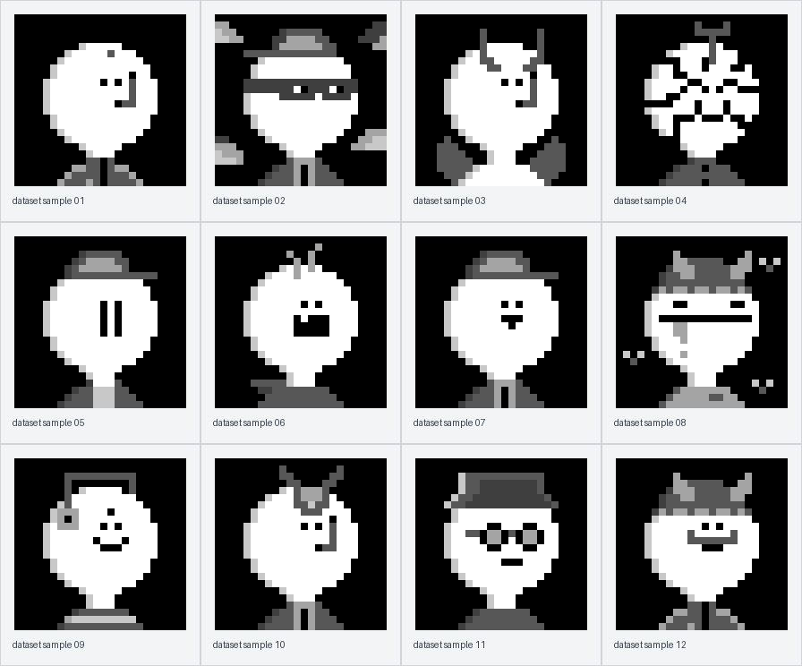
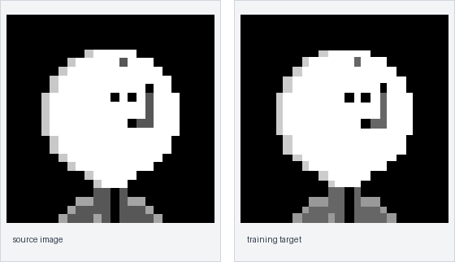
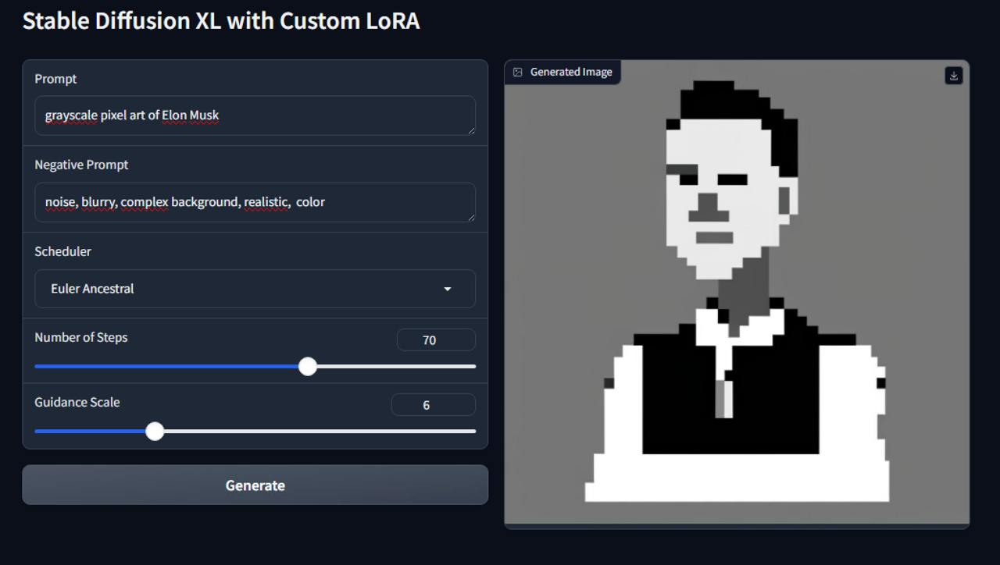
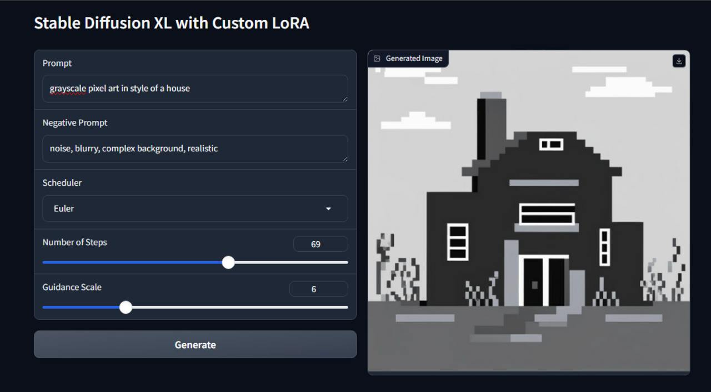
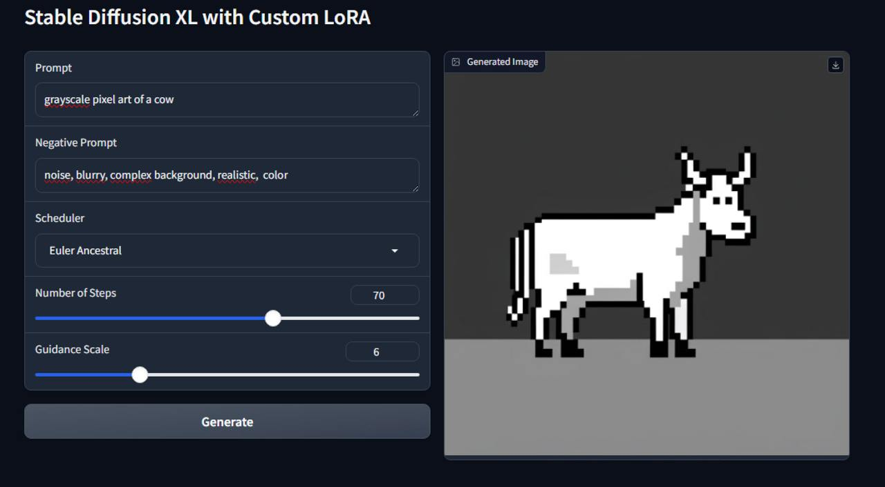

# pixelart-lora

LoRA training and inference tooling for a small grayscale pixel-art character style. The training pipeline uses the public
[`mattsava/nob`](https://huggingface.co/datasets/mattsava/nob) dataset, fine-tunes SDXL on Modal GPUs, and ships with a
local Gradio app backed by a remote Modal inference function.

This is a deliberately constrained image problem. The target style is not "make a cute character" in a continuous
photographic space; the model has to stay inside a low-resolution pixel-art language: blocky silhouettes, hard nearest
neighbor edges, a small grayscale palette, and readable character features built out of very few pixels.



## Why This Is Hard

Most diffusion models are comfortable with smooth texture, lighting, soft edges, and gradual color transitions. This
dataset asks for almost the opposite. A good sample needs to preserve a discrete grid, land on a tiny set of gray levels,
and still complete the character style when the prompt changes.

The training target is therefore shaped before it reaches the VAE:



The preprocessing step converts each image to grayscale, downsamples it to a low-resolution working grid, upsamples it
back with nearest-neighbor interpolation, and snaps every pixel to one of six fixed gray levels. That makes the diffusion
loss learn from the same kind of image we want at sampling time instead of asking an auxiliary loss to fix the style after
the fact.

## What the Pipeline Does

- Loads the Hugging Face dataset through a small `Dataset` wrapper.
- Applies the pixel-art transform in the data pipeline, before VAE encoding.
- Fine-tunes SDXL attention layers with LoRA adapters through PEFT.
- Uses full SDXL conditioning: CLIP-L, CLIP-bigG, penultimate hidden states, pooled text embeddings, and time IDs.
- Runs training remotely on Modal with pinned dependencies and persistent cache/output volumes.
- Exposes a Gradio UI that calls a deployed Modal GPU function for generation.

## Demo

The local Gradio app calls Modal for inference and currently uses
[`mattsava/rob-lora-checkpoint-2500`](https://huggingface.co/mattsava/rob-lora-checkpoint-2500) on top of
`black-forest-labs/FLUX.1-dev`. The checkpoint captures the same kind of pixel-art constraints: reduced grayscale range,
hard edges, simple body shapes, and minimal facial detail.

These examples are there for a specific reason. They are not near-copies of the training images; they ask the LoRA to use
the same visual grammar on different subjects: a portrait, a house, and an animal. The consistency is the point here:
flat grayscale areas, thick pixel outlines, readable shapes, and no photographic texture.

<p align="center">
  
  
  
</p>
<p align="center">
  <sub>Portrait prompt, house prompt, and cow prompt rendered into the same constrained grayscale pixel-art style.</sub>
</p>

The ROB checkpoint contains FLUX `transformer.*` LoRA weights plus text-encoder keys. The demo loads the transformer LoRA
weights only; the text-encoder keys hit a Diffusers PEFT conversion edge case in the pinned stack.

## Modal Setup

Install and sync the pinned environment:

```bash
uv sync
```

Authenticate Modal:

```bash
uv run modal setup
```

Create a Hugging Face secret for Modal. This is recommended for SDXL and FLUX downloads, especially if the account needs
to accept model terms:

```bash
uv run modal secret create huggingface-secret HF_TOKEN=hf_your_token_here
```

The Modal app uses:

- `jalb-hf-cache` for Hugging Face model and dataset cache.
- `jalb-lora-outputs` for trained LoRA checkpoints.
- `A100-40GB` GPU functions for both training and inference.
- A pinned Modal image built with `uv_pip_install`.

## Train

```bash
uv run modal run src/train_jalb/modal_app.py \
  --dataset-name mattsava/nob \
  --output-name jalb-lora-v2 \
  --max-train-steps 1500 \
  --learning-rate 1e-4 \
  --mixed-precision bf16
```

Optional low-noise quantization regularizer:

```bash
uv run modal run src/train_jalb/modal_app.py \
  --output-name jalb-lora-v2-qreg \
  --max-train-steps 1500 \
  --w-quant-reg 0.1 \
  --quant-reg-max-t 200
```

Download a trained checkpoint from the Modal output volume:

```bash
uv run modal volume get jalb-lora-outputs /jalb-lora-v2 ./jalb-lora-v2
```

## Run the Gradio App

Deploy the Modal GPU functions:

```bash
uv run modal deploy src/train_jalb/modal_app.py
```

Launch the local UI:

```bash
uv run python -m train_jalb.gradio_app
```

Open `http://127.0.0.1:7860`.

## Local Checks

```bash
uv run pytest
uv run ruff check .
uv lock --locked
```

## Project Layout

```text
src/train_jalb/
  config.py      Training configuration and validation
  data.py        Hugging Face dataset wrapper and collate function
  gradio_app.py  Local Gradio UI backed by Modal inference
  inference.py   FLUX LoRA inference helpers for the demo
  modal_app.py   Modal image, volumes, GPU functions, and local entrypoint
  quantization.py
                 Six-level grayscale quantizer and pixel-art transform
  sdxl.py        SDXL prompt/time/x0 helper functions
  train.py       SDXL LoRA training loop
tests/
  test_inference.py
  test_quantization.py
  test_sdxl_helpers.py
assets/
  dataset-samples.png
  example-cow.jpg
  example-house.jpg
  example-musk.jpg
  target-transform.png
```
